<p align="center"></p>

# qdrant-vllm

**qdrant-fabric-Ops**: an Ollama model specialized for the **Qdrant vector ops**, part of git-fabric's **fabric-llm** layer (`L3+L6 foundry`).

It answers questions about its domain locally, so the fabric only escalates to Claude when it has to. See [fabric-sdk](https://github.com/git-fabric/sdk) for how requests are routed.

| | |
|---|---|
| Base model | `qwen2.5:14b` |
| Context window | 8,192 tokens |
| Temperature | 0.15 |

## Use it

```bash
ollama create qdrant-fabric-ops -f Modelfile
ollama run qdrant-fabric-ops
```

## What's inside

A single [`Modelfile`](Modelfile): the base model, its sampling parameters, and a system prompt that teaches the model the Qdrant vector ops.

<!-- org-footer -->
---

<p align="center"><sub>Part of <a href="https://github.com/git-fabric">git-fabric</a> · composable fabric apps for Git-native infrastructure · built by <a href="https://github.com/ry-ops">ry-ops</a></sub></p>
